# Velumia sprint ceremony (ChatPRD-first)

**Applies to:** every V1 Feature sprint (`/sprint-start LIE-NNN`)  
**Last update:** 2026-06-30

## Principle

ChatPRD is the **authoring surface** for sprint planning artifacts. Local files under `.ai/velumia-sprints/LIE-NNN/` are **mirrors** synced via **velumia-planning-chatprd-sync**. Both documents are **linked on the Linear issue**.

## Two documents per sprint

| Document | Owner | Timing | ChatPRD template |
|----------|-------|--------|------------------|
| Sprint PRD | PO | **Before** refinement | (PO structure) |
| Implementation Spec | Devs (SM coordinates) | **After** PRD agreement | [`templates/chatprd/chatprd_feature-implementation-spec.tpl.md`](../../templates/chatprd/chatprd_feature-implementation-spec.tpl.md) (**ChatPRD: Feature Implementation Spec**) |

## Ceremony flow

```mermaid
flowchart TD
  SM[SM: sprint folder from templates]
  Retro[retro carry-over]
  RetroBlocked{Undecided after 5 rounds?}
  RetroStake[Stakeholder retro — decisions.md]
  SecCarry[security carry-over with stakeholder]
  ArchCarry[architecture carry-over]
  ArchBlocked{Undecided after 5 rounds?}
  ArchStake[Stakeholder architecture — decisions.md]
  PRDCreate[PO: create sprint PRD in ChatPRD]
  Refine[refinement incl arch sec impact]
  PRDUpdate[PO: update sprint PRD]
  Agree{PO and devs agree?}
  ImplCreate[Devs: Implementation Spec]
  SecPlan[security Planning review]
  ArchPlan[architecture Planning review]
  Gate[Planning gate to In Progress]
  Impl[Implementation]
  SecImpl[security Implementation review]
  ArchImpl[architecture Implementation review]
  QA[QA DoD checklist]
  Review[In Review stakeholder demo]

  SM --> Retro --> RetroBlocked
  RetroBlocked -->|yes| RetroStake --> SecCarry
  RetroBlocked -->|no| SecCarry
  SecCarry --> ArchCarry --> ArchBlocked
  ArchBlocked -->|yes| ArchStake --> PRDCreate
  ArchBlocked -->|no| PRDCreate
  PRDCreate --> Refine --> PRDUpdate --> Agree
  Agree -->|no| Refine
  Agree -->|yes| ImplCreate --> SecPlan --> ArchPlan --> Gate
  Gate --> Impl --> SecImpl --> ArchImpl --> QA --> Review
```

## Planning gate

- [ ] Prior sprint `retro.md` reviewed; due actions integrated or stakeholder-closed (`retro-carryover.md`)
- [ ] Open security findings dispositioned with stakeholder (`security-carryover.md`)
- [ ] Open architecture findings integrated or stakeholder-closed (`architecture-carryover.md`)
- [ ] Sprint PRD created before refinement; updated after refinement; synced locally
- [ ] Refinement includes Architecture and security impact topic
- [ ] Implementation Spec created after PRD agreement from repo template; includes § Architecture and security impact; synced locally
- [ ] Both documents linked on Linear issue
- [ ] Implementation Spec includes sub-agent ownership and handoffs
- [ ] Story points on Linear issue
- [ ] Security Planning review complete (`security-review.md`)
- [ ] Architecture Planning review complete (`architecture-review.md`)
- [ ] ≤5 refinement rounds or stakeholder sign-off on escalations

## Before Review gate

- [ ] QA `dod-checklist.md` complete (security + architecture review items)
- [ ] Security Implementation review complete (`security-review.md`)
- [ ] Architecture Implementation review complete (`architecture-review.md`)

## Implementation

SM delegates per **Implementation Spec** sub-agent ownership. Handoffs must complete before downstream subtasks close.

## Skills and agents

- Skill: `.cursor/skills/velumia-sprint-start/SKILL.md`
- Skill: `.cursor/skills/velumia-planning-chatprd-sync/SKILL.md`
- Skill: `.cursor/skills/velumia-security-review/SKILL.md`
- Skill: `.cursor/skills/velumia-architecture-review/SKILL.md`
- SM: `.cursor/agents/velumia-scrum-sm.md`
- PO: `.cursor/agents/velumia-scrum-po.md`
- Security: `.cursor/agents/velumia-dev-security.md`
- Architect: `.cursor/agents/velumia-dev-architect.md`

## ChatPRD project

`projectId: asst_WVuIAcqzH1O6ERmhWHE91UGL`
