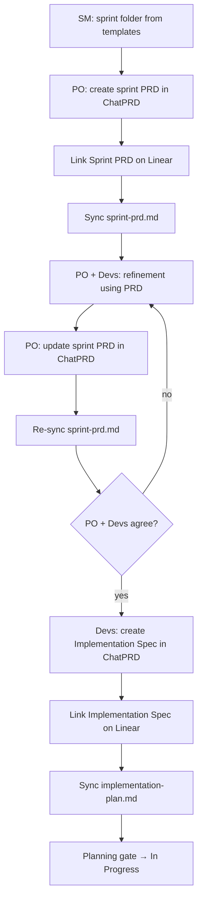

# Velumia sprint ceremony (ChatPRD-first)

**Applies to:** every V1 Feature sprint (`/sprint-start LIE-NNN`)  
**Last update:** 2026-06-14

## Principle

ChatPRD is the **authoring surface** for sprint planning artifacts. Local files under `.ai/velumia-sprints/LIE-NNN/` are **mirrors** synced via **velumia-planning-chatprd-sync**. Both documents are **linked on the Linear issue**.

## Two documents per sprint

| Document | Owner | Timing | ChatPRD template |
|----------|-------|--------|------------------|
| Sprint PRD | PO | **Before** refinement | (PO structure) |
| Implementation Spec | Devs (SM coordinates) | **After** PRD agreement | **ChatPRD: Feature Implementation Spec** |

## Ceremony flow

## Planning gate

- [ ] Sprint PRD created before refinement; updated after refinement; synced locally
- [ ] Implementation Spec created after PRD agreement; synced locally
- [ ] Both documents linked on Linear issue
- [ ] Implementation Spec includes sub-agent ownership and handoffs
- [ ] Story points on Linear issue
- [ ] Security Planning review complete
- [ ] ≤5 refinement rounds or stakeholder sign-off on escalations

## Implementation

SM delegates per **Implementation Spec** sub-agent ownership. Handoffs must complete before downstream subtasks close.

## Skills and agents

- Skill: `.cursor/skills/velumia-sprint-start/SKILL.md`
- Skill: `.cursor/skills/velumia-planning-chatprd-sync/SKILL.md`
- SM: `.cursor/agents/velumia-scrum-sm.md`
- PO: `.cursor/agents/velumia-scrum-po.md`

## ChatPRD project

`projectId: asst_WVuIAcqzH1O6ERmhWHE91UGL`
